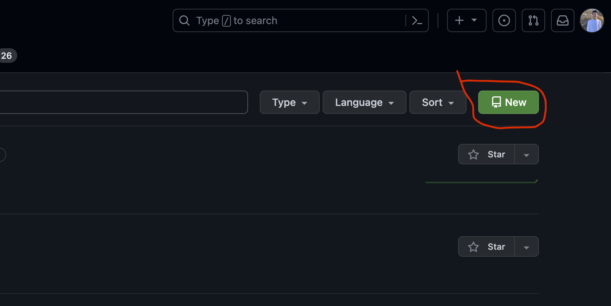
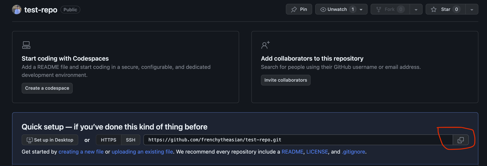

# Git and Github Tutorial

## Table of Contents
- [Git and Github Tutorial](#git-and-github-tutorial)
  - [Table of Contents](#table-of-contents)
  - [Setup and Installation](#setup-and-installation)
  - [Basic Git Commands](#basic-git-commands)
  - [Tutorial](#tutorial)

## Introduction
Git is a version control system that allows you to track changes to your code. A version control system is a tool that allows you to keep track of changes to your code/files and collaborate with others. It is a very powerful tool that is used by many companies and open source projects. 

Github is a website that allows you to store your git repositories online. It allows you to share your code with others and collaborate on projects. This tutorial will walk you through the basics of git and github.

## Setup and Installation
1. Install git from [here](https://git-scm.com/downloads)
2. Create a github account [here](https://github.com/)
3. (Optional) Install VSCode from [here](https://code.visualstudio.com/download)
    - This tutorial will make use of your computers command line to perform git commands. If you would rather interact with git through a GUI, you can install VSCode and follow this tutorial [here](vscode-git.md)

## Basic Git Terms and Commands

### Working by yourself
These are the basic git commands you will need to know to use git when working on a solo project.
- repository
    - A repository is a folder that is being tracked by git. It is also called a repo for short. 
- `git init`
    - Initializes a git repository in the current directory. This will tell git that the folder you are in is a repository and it will start tracking changes to the files in that folder.
- `git clone <url>`
    - Clones a repository from github. This will create a copy of the repository on your computer. You can then make changes to the repository and push those changes back to github. 
    - Cloning is very similar to "downloading"
- `git status`
    - Shows the current status of the repository. It will show you what files have been changed and what files are being tracked by git.
- `git add <file>`
    - Adds a file to the staging area. The staging area is where you can add files before you commit them. 
    - Instead of passing a file to the command, you can use `git add .` to add all files in the current directory to the staging area.
- `git commit -m "<message>"`
    - Commits the files in the staging area. This will create a snapshot of the files in the staging area. You can think of a commit as a save point. 
    - The `-m` flag allows you to pass a message to the commit. This message should be a short description of the changes you made in the commit.
- `git push`
    - Pushes the commits you have made to github. This will update the repository on github with the commits you have made.
- `git pull`
    - Pulls the latest changes from github. This will update your local repository with the latest changes from github.

### Working with others
These are the basic git commands you will need to know to use git when working on a project with others.
- branch
    - A branch is a copy of the repository. It allows you to make changes to the repository without affecting the main repository.
- pull request
    - A pull request is a request to merge a branch into the main repository. It allows you to review the changes made in the branch before merging them into the main repository.
- `git branch <branch-name>`
    - Creates a new branch with the given name. This will create a copy of the repository that you can make changes to without affecting the main repository.
- `git checkout <branch-name>`
    - Switches to the given branch. This will allow you to make changes to the given branch.
- `git merge <branch-name>`
    - Merges the given branch into the current branch. This will take the changes made in the given branch and merge them into the current branch.

## Tutorial
1. Create a new repository on github
    - Go to [github.com](https://github.com/) and login to your account
    - Navigate to the repositories tab and click the "New" button as shown in the following image
    - 
    - Give your repository a name and click the "Create repository" button at the bottom of the screen (You can leave the other options as their default values)
2. Download your repo to your local machine
    - Copy the url of your repository
    - 
    - Open a terminal and navigate to the directory you want to store your repository in
    - run the command `git clone <url>` where `<url>` is the url you copied in the previous step
    - You can now open this folder in VSCode or your favorite text editor
3. Make some changes to your repository
    - Create a new file called `HelloWorld.txt` and add the following text to it
    ```
    Hello World!
    ```
    - Save the file
4. Commit your changes
    - Open a terminal and navigate to the directory of your repository
    - Run the command `git status` to see the status of your repository
    - You should see that there is a new file that has been added to your repository
    - 
    - Run the command `git add .` to add all files in the current directory to the staging area
    - Run the command `git commit -m "Added HelloWorld.txt"` to commit the files in the staging area
    - Run the command `git push` to push your commits to github
    - You should now see your changes on github