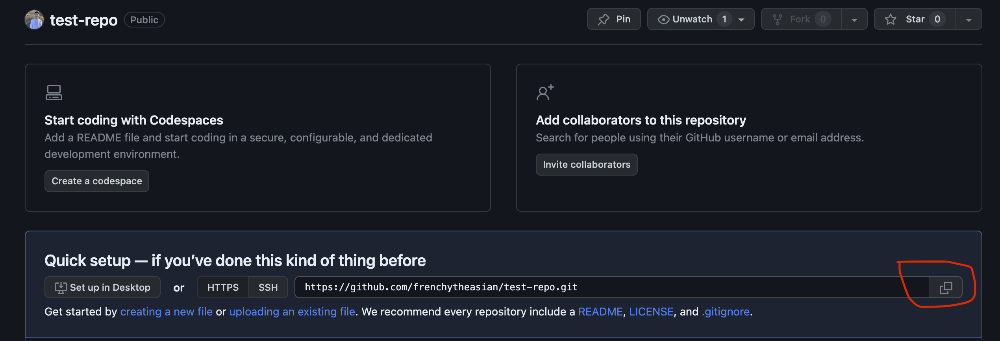
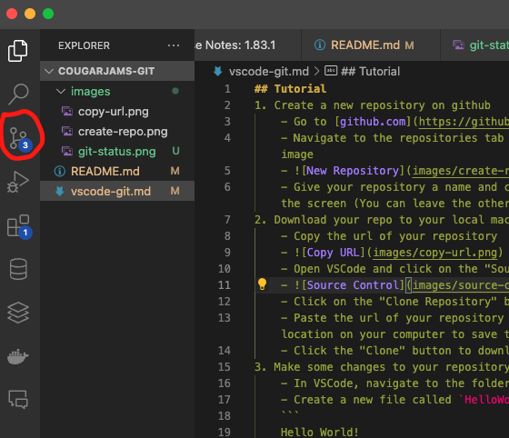
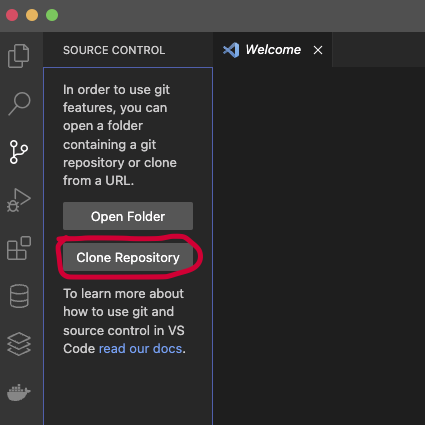
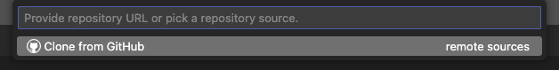

## Tutorial
1. Create a new repository on github
    - Go to [github.com](https://github.com/) and login to your account
    - Navigate to the repositories tab and click the "New" button as shown in the following image
    - 
    - Give your repository a name and click the "Create repository" button at the bottom of the screen (You can leave the other options as their default values)
2. Download your repo to your local machine
    - Copy the url of your repository
    - 
    - Open VSCode and click on the "Source Control" icon on the left-hand side of the window
    - 
    - Click on the "Clone Repository" button at the top of the "Source Control" panel
    - 
    - Paste the url of your repository into the "Repository URL" field and choose a location on your computer to save the repository
    - 
3. Make some changes to your repository
    - In VSCode, navigate to the folder where you saved your repository
    - Create a new file called `HelloWorld.txt` and add the following text to it
    ```
    Hello World!
    ```
    - Save the file
4. Commit your changes
    - In VSCode, click on the "Source Control" icon on the left-hand side of the window
    - You should see the file you just created in the "Changes" section of the "Source Control" panel
    - Click on the "+" icon next to the file to stage the changes
    - Enter a commit message in the text box at the top of the "Source Control" panel and press "Ctrl+Enter" to commit the changes
    - Click on the "..." icon in the "Source Control" panel and select "Push" to push your changes to github
5. View your changes on github
    - Go to your repository on github.com
    - You should now see your changes on github

